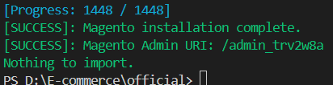

# E-commerce
Đây là repo để phát triển trang thương mại điện tử dựa trên magento, dành cho các nhà phát triển trong nhóm
## Giới thiệu
 - Các file trong branch này được sử dụng để đóng gói hoàn toàn việc cài đặt magento trên docker, được tách bạch hoàn toàn so với local
 - Vì vậy, bạn sẽ không cần phải cài cài đặt bất cứ công cụ nào trên máy của mình cả - ngoại trừ [Docker](https://docs.docker.com/engine/install/)!
# Config github
```git config --global core.autocrlf false```
```git config --system core.longpaths true```
# Cài đặt sẵn
## Chạy các lệnh sau để vào magento
1. chạy ```docker compose build```
2. chạy ```docker compose up -d```
## Phát triển
- Vào Terminal Run as administrator, vào đường dẫn dự án
1. Khi pull (nhận các thay đổi của nhóm), chạy
    - ```docker cp ./magento/. php:/var/www/html/magento``` để cập nhật code, ảnh,...
    - ```docker compose exec mysql bash -c "./restore.sh"``` để cập nhật database
2. Khi push (chia sẻ thay đổi cho nhóm), chạy
    - ```docker cp php:/var/www/html/magento/. ./magento```
    - ```docker compose exec mysql bash -c "./backup.sh"```
## Chạy
- Vào đường link http://localhost:8080
# Cài đặt từ đầu
## Cài đặt Magento
- Chuyển đến thư mục chứa repo của bạn
- Công việc tiên quyết: tạo file .env:
    - Tạo 1 file có tên là .env ở thư mục hiện tại (thư mục gốc của repo)
    - copy mã từ file .env.example -> .env
    - Lần lượt thay thế giá trị của USERNAME_MAGENTO_KEY và PASSWORD_MAGENTO_KEY bằng Public Key và Private Key của magento authentication keys và điền giá trị của các biến còn lại. Hướng dẫn chi tiết lấy magento keys [ở đây](#tạo-acess-key-magento) 
- Thực hiện lần lược các công việc/lệnh sau:
1. chạy ```docker compose build```
2. chạy ```docker compose up -d```
3. chạy ```docker compose exec php bash -c "./install-magento.sh"```, cài đặt và setup magento, lưu ý rằng cần lưu lại admin uri tại bước này.<br>

4. Đợi khoảng 15' -> Done!
## Kiểm tra cài đặt
- Vào đường link http://localhost:8080, nếu xuất hiện giao diện bên dưới thì ok

- Vào admin để trải nghiệm. VD admin uri của bạn là /admin_88c1kjr thì nhập http://localhost:8080/admin_88c1kjr sau đó đăng nhập
## Tạo Acess Key Magento
Thực hiện lần lượt các bước sau:
1. Vào [Commercemarketplace](https://commercemarketplace.adobe.com/)
2. Đăng nhập 
3. Bấm vào phần tên cạnh giỏ hàng góc trên cùng bên phải rồi bấm vào My profile
4. Xuất hiện 1 số tùy chọn, vào Access Key
5. Tạo Acess Key bằng cách bấm vào Create A New Access Key hoặc sử dụng cái đã có sẵn
6. Copy Public và Private Key và sử dụng.
## Phát triển:
- Luôn thực hiện: (để cập nhật database và magento)
    - Trước khi push github: ```docker compose exec mysql bash -c "./backup.sh"```
    - Sau khi pull github: 
        1. ```docker compose exec mysql bash -c "./restore.sh"```
        2. ```docker compose exec php ./magento/bin/magento setup:upgrade```
    - Chạy lệnh ```rsync -av --delete ./magento/ /magento``` để update magento trên local
## Sample data
1. Vào ```docker compose exec php bash```, vào folder magento ```cd magento```
2. ```php bin/magento deploy:mode:set developer```
3. ```rm -rf generated/code/* generated/metadata/*```
4. ```php bin/magento sampledata:deploy```
5. ```php -d memory_limit=512M bin/magento setup:upgrade```
6. ```php bin/magento cache:clean && php bin/magento cache:flush```

