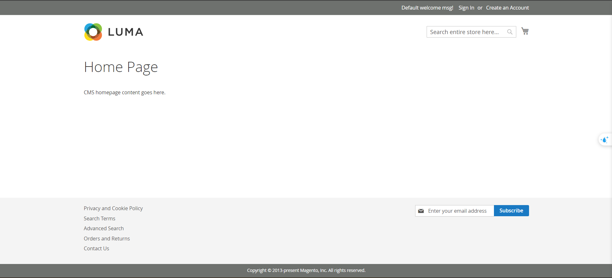

# E-commerce
Đây là repo để phát triển trang thương mại điện tử dựa trên magento, dành cho các nhà phát triển trong nhóm
## Giới thiệu
 - Các file trong branch này được sử dụng để đóng gói hoàn toàn việc cài đặt magento trên docker, được tách bạch hoàn toàn so với local
 - Vì vậy, bạn sẽ không cần phải cài cài đặt bất cứ công cụ nào trên máy của mình cả - ngoại trừ [Docker](https://docs.docker.com/engine/install/)!
## Cài đặt Magento
- Chuyển đến thư mục chứa repo của bạn
- Công việc tiên quyết: tạo file .env:
    - Tạo 1 file có tên là .env ở thư mục hiện tại (thư mục gốc của repo)
    - copy mã từ file .env.example -> .env
    - Lần lượt thay thế giá trị của USERNAME_MAGENTO_KEY và PASSWORD_MAGENTO_KEY bằng Public Key và Private Key của magento authentication keys và điền giá trị của các biến còn lại. Hướng dẫn chi tiết lấy magento keys [ở đây](#tạo-acess-key-magento) 
- Thực hiện lần lược các công việc/lệnh sau:
1. chạy ```docker compose build```
2. chạy ```docker compose up -d```
3. Đợi khoảng 15' -> Done!
## Kiểm tra cài đặt
- Vào đường link http://localhost:8080, nếu xuất hiện giao diện bên dưới thì ok

## Tạo Acess Key Magento
Thực hiện lần lượt các bước sau:
1. Vào [Commercemarketplace](https://commercemarketplace.adobe.com/)
2. Đăng nhập 
3. Bấm vào phần tên cạnh giỏ hàng góc trên cùng bên phải rồi bấm vào My profile
4. Xuất hiện 1 số tùy chọn, vào Access Key
5. Tạo Acess Key bằng cách bấm vào Create A New Access Key hoặc sử dụng cái đã có sẵn
6. Copy Public và Private Key và sử dụng.


